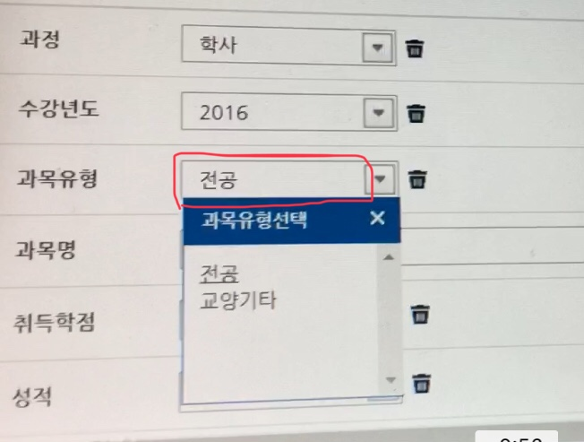

# samsungGradeinput
삼성 채용 이력서 작성에 필요한 이수학점 입력을 크롤링으로 해결합니다.

__주의사항__ *경북대yes에서 제공하는 전체성적파일 양식을 따릅니다. *파이썬 에디터가 필요합니다.

### 초기 설정
1. 전체 파일을 다운로드합니다.
2. 본인의 크롬의 버전에 맞는 chromdriver를 원하는 위치에 설치합니다. https://chromedriver.chromium.org/downloads
3. 경북대 yes에 접속하여 성적 카테고리에 들어가 전체 이수성적 엑셀파일을 다운로드합니다.
   * xls 파일 형식일 경우 xlsx로 업그레이드시켜줍니다. (xls는 프로그램에서 다룰 수 없습니다.)
4. 전체성적 엑셀파일을 편의를 위해서 파이썬 파일(gradecraw.py)과 같은 위치에 둡니다.
5. 파이썬 파일을 편집 모드로 열어주시고, ####주석을 찾습니다.

        #따옴표안에 아이디(이메일)와 비밀번호를 적습니다.
        s_id, s_pa = '' 
        
        #따옴표안에 전체성적.xlsx파일의 경로를 적습니다. 파이썬 파일과 같은 위치일경우 pass
        load_wb = load_workbook("전체성적.xlsx", data_only=True)
        
        #따옴표안에 chromedriver의 경로를 적습니다. 밑과 같은 위치라면 pass
        driver = webdriver.Chrome('C:\\chromedriver')
        
        # 63번 줄에 있는 코드에서 엑셀에 끝항목을 적어주세요 예로 F50에 끝난다면 F3 자리에 F50으로 고쳐주세요
        # 여유공간을 두어도 무방합니다. 
        multiple_cells = load_ws['A2':'F3']

### 설정이 끝나면
* 파이썬 에디터에서 파이썬 파일을 실행시켜주세요. 크롬 창이 뜨고 크롤링이 시작됩니다.
* 콘솔 창에 나오는 에러는 확인을 위해 나오는 것입니다. 계속 진행하시면 됩니다.
  * 같은 에러가 계속해서 나오고, 크롤링이 멈춘 것같다면 해당되는 하얀색 칸을(사진 참고) 한번만 클릭해주세요
    </img>
  * 다른 에러가 뜬다면 프로그램을 종료시키고, 다시 실행해주세요.
* 파이썬이 실행시킨 크롬창을 최소화하면 안됩니다. 진행이 안됩니다. 
* 이 프로그램은 1회수강을 고정해두고있습니다. 재이수 과목이 있을 경우 (프로그램이 끝나고) 직접 수정해야합니다.

### *프로그램이 끝난다면, 창을 끄기 전에 삼성 이력서 저장을 해주세요!*
